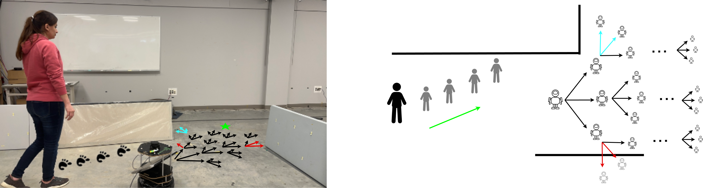

# Robotic Follow-Ahead with Obstacle and Occlusion Avoidance
This is a repository for the paper ["An MCTS-DRL Based Obstacle and Occlusion Avoidance Methodology in Robotic Follow-Ahead Applications"](https://arxiv.org/pdf/2309.16884.pdf) presented at IROS 2023 conference. 


Our methodology employs a high-level decision-making algorithm that strategically navigates a mobile robot in front of a person while 
avoiding collision and occlusion in any environment.




A DQN model (Q-model) of the robot is integrated with Monte Carlo Tree Search (MCTS) in order to enhance the performance of the decision-making process. 
The DQN package contains the code to train the Q-model. A simulation environment is written to input a state and action and calculate the corresponding next state and reward. Also, a pre-trained model is provided under the /models directory which is trained in an obstacle-free environment. The model inputs the relative pose of the robot with respect to the human and outputs the expected return of taking each action. The actions are going straight, turning left or right.

The MCTS package contains the codes to expand a tree at each time step and find the best navigational goal for the robot. The trained Q-model is used during the tree expansion process to evaluate each node of the tree.

## Experiments:


## Prerequisites:
1. An occupancy map of the environment
2. A module to output the position of the human. We used ZED2 camera and ZED-ros-wrapper package that publishes '/zed2/zed_node/obj_det/objects' topic. You can change this topic in the 'human_traj_pred.py' file.


## Getting Started:
1. ROS (Noetic version is preferred)
2. Please refer to the setup.txt file to install the proper version of the libraries.
3. Run the '.launch' file using roslaunch 


## Citation
If you happen to use the code for your research, please cite the following paper

```
@article{leisiazar2023mcts,
  title={An MCTS-DRL Based Obstacle and Occlusion Avoidance Methodology in Robotic Follow-Ahead Applications},
  author={Leisiazar, Sahar and Park, Edward J and Lim, Angelica and Chen, Mo},
  journal={arXiv preprint arXiv:2309.16884},
  year={2023}
}

```
